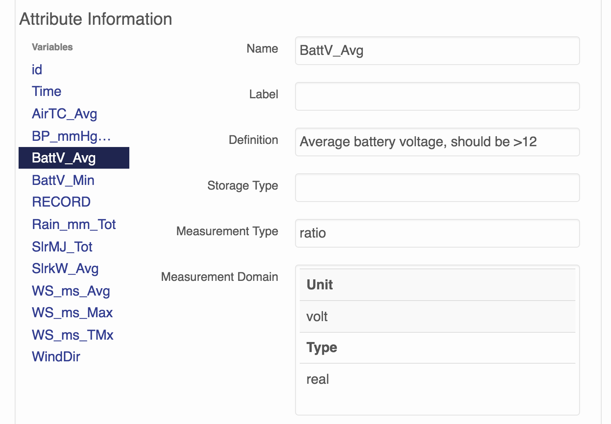
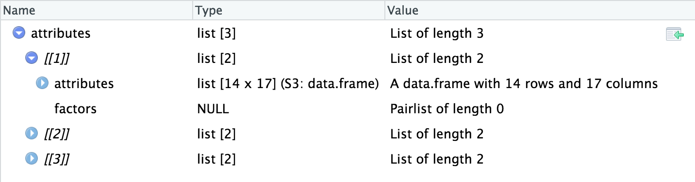

Extracting EML metadata using R
================

Each dataset in the [Arctic Data Center](https://arcticdata.io/) has associated metadata that displays on the data package page (for example, [here](doi.org/10.18739/A2X86K)), which can also be downloaded as an \*.xml file.

You can scroll through attribute (variable) metadata in the *Attribute Information* section of a Data Table or Other Entity, but sometimes it's easier to have examine this information using tabular data.



Thankfully, this is easily done using the `EML` package in R!

Start by downloading the EML file to a local directory. Alternatively, use `RCurl` to download the file from my github directory and follow along. Use `read_eml()` to load it into your R environment.

``` r
library(RCurl)
library(EML)

eml_web <- RCurl::getURL("https://raw.githubusercontent.com/isteves/tutorials/master/data/LeConte_meteo_metadata.xml")
eml <- read_eml(eml_web) 
# if you've downloaded the *.xml file, replace eml_web with your file path 
#(i.e., "home/isteves/my_metadata.xml")
```

We usually only have attributes for data tables, which we can grab from our EML using `eml_get`.

``` r
attributes <- eml_get(eml, "attributeList")
```

The variable, `attributes`, now has all the attribute information in the package stored as a list. For this example, we have three attribute objects.

``` r
class(attributes)
```

    ## [1] "list"

``` r
length(attributes)
```

    ## [1] 3

Each list object contains another list of 2 objects: (1) *attribute* information in the form of a dataframe and (2) *factors* to store information about enumerated domains within the dataset. A column titled "Fruit", for example, may include data (`c("o", "g", "p", "o")`) as factors (o = orange, g = grape, p = pineapple).



To extract a single dataframe and save it to a csv, simply run:

``` r
attribute1 <- attributes[[1]]$attributes
write.csv(attribute1, "attribute1.csv")
```

    ##    attributeName         domain precision minimum maximum
    ## 1             id     textDomain        NA    <NA>    <NA>
    ## 2           Time dateTimeDomain        NA    <NA>    <NA>
    ## 3      AirTC_Avg  numericDomain        NA    <NA>    <NA>
    ## 4    BP_mmHg_Avg  numericDomain        NA    <NA>    <NA>
    ## 5      BattV_Avg  numericDomain        NA    <NA>    <NA>
    ## 6      BattV_Min  numericDomain        NA    <NA>    <NA>
    ## 7         RECORD     textDomain        NA    <NA>    <NA>
    ## 8    Rain_mm_Tot  numericDomain        NA    <NA>    <NA>
    ## 9      SlrMJ_Tot  numericDomain        NA    <NA>    <NA>
    ## 10     SlrkW_Avg  numericDomain        NA    <NA>    <NA>
    ## 11     WS_ms_Avg  numericDomain        NA    <NA>    <NA>
    ## 12     WS_ms_Max  numericDomain        NA    <NA>    <NA>
    ## 13     WS_ms_TMx dateTimeDomain        NA    <NA>    <NA>
    ## 14       WindDir  numericDomain        NA    <NA>    <NA>
    ##                  unit numberType        formatString    definition pattern
    ## 1                <NA>       <NA>                <NA>    row number    <NA>
    ## 2                <NA>       <NA> YYYY-MM-DD hh:mm:ss          <NA>    <NA>
    ## 3             celsius       real                <NA>          <NA>    <NA>
    ## 4  millimetersMercury       real                <NA>          <NA>    <NA>
    ## 5                volt       real                <NA>          <NA>    <NA>
    ## 6                volt       real                <NA>          <NA>    <NA>
    ## 7                <NA>       <NA>                <NA> record number    <NA>
    ## 8          millimeter       real                <NA>          <NA>    <NA>
    ## 9           megajoule       real                <NA>          <NA>    <NA>
    ## 10           kilowatt       real                <NA>          <NA>    <NA>
    ## 11    metersPerSecond       real                <NA>          <NA>    <NA>
    ## 12    metersPerSecond       real                <NA>          <NA>    <NA>
    ## 13               <NA>       <NA> YYYY-MM-DD hh:mm:ss          <NA>    <NA>
    ## 14             degree       real                <NA>          <NA>    <NA>
    ##    source attributeLabel storageType missingValueCode
    ## 1    <NA>           <NA>        <NA>             <NA>
    ## 2    <NA>           <NA>        <NA>             <NA>
    ## 3    <NA>           <NA>        <NA>               ""
    ## 4    <NA>           <NA>        <NA>               ""
    ## 5    <NA>           <NA>        <NA>               ""
    ## 6    <NA>           <NA>        <NA>               ""
    ## 7    <NA>           <NA>        <NA>               ""
    ## 8    <NA>           <NA>        <NA>               ""
    ## 9    <NA>           <NA>        <NA>               ""
    ## 10   <NA>           <NA>        <NA>               ""
    ## 11   <NA>           <NA>        <NA>               ""
    ## 12   <NA>           <NA>        <NA>               ""
    ## 13   <NA>           <NA>        <NA>               ""
    ## 14   <NA>           <NA>        <NA>               ""
    ##    missingValueCodeExplanation measurementScale
    ## 1                         <NA>          nominal
    ## 2                         <NA>         dateTime
    ## 3      station not operational         interval
    ## 4      station not operational         interval
    ## 5      station not operational            ratio
    ## 6      station not operational            ratio
    ## 7      station not operational          nominal
    ## 8      station not operational            ratio
    ## 9      station not operational            ratio
    ## 10     station not operational            ratio
    ## 11     station not operational            ratio
    ## 12     station not operational            ratio
    ## 13     station not operational         dateTime
    ## 14     station not operational         interval
    ##                                                                                                                                                            attributeDefinition
    ## 1                                                                                                                                                                   Row number
    ## 2  Time in UTC; Values reported always correspond to the subsequent time interval (e.g. 13:00 corresponds to the time interval 13:00 to 14:00 in the case of the hourly data).
    ## 3                                                                                                                                           Average air temperature in celsius
    ## 4                                                                                                                                         Average barometric pressure in mm Hg
    ## 5                                                                                                                                       Average battery voltage, should be >12
    ## 6                                                                                                                                                      Minimum battery voltage
    ## 7                                                                                                                                                                Record number
    ## 8                                                                                                                      Total rain in mm, summed over each measurement interval
    ## 9                                                                                                                             Total incoming shortwave radiation in megajoules
    ## 10                                                                                                                           Average incoming shortwave radiation in kilowatts
    ## 11                                                                                                                                                   Average wind speed in m/s
    ## 12                                                                                                                                                   Maximum wind speed in m/s
    ## 13                                                                                                                                                  Time of maximum wind speed
    ## 14                                                                                                                                                   Wind direction in degrees
