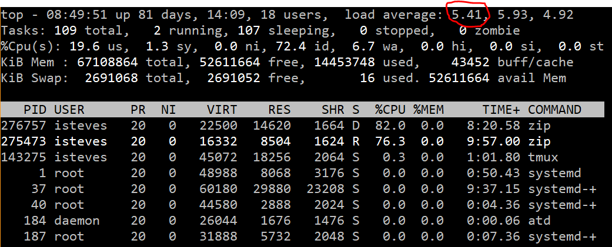

Zipping files on the server
===========================

While it's possible to zip files in R, it may be faster and more efficient to zip files directly in the terminal. Here's how it's done:

1.  Open up the Terminal (or navigate to it through RStudio via *Tools* &gt; *Shell*).

2.  Connect to the server by typing `ssh USERNAME@datateam.nceas.ucsb.edu`. Type in your password when prompted. *Note:* the letters won't pop up as you type your password, but just trust that you're typing correctly and press enter when you're done.

3.  Navigate to the location of the folders you want to zip up. You can use `pwd` to print your current working directory and `cd /dir/dir2/dir3` to deeper into your folders. *Note:* special characters in folder names, such as spaces, need to be escaped with a backslash (`\`).

4.  Now start some new tmux sessions so that you can run several processes in parallel. Type `tmux new -s SESSIONNAME`.

5.  In your tmux session, type `zip -r FOLDER.zip FOLDER` to zip up any folder recursively. If you omit `-r`, only the first "level" of the folder will be included in the zip file.

6.  Now exit, or detach, your tmux session to let it keep running in the background. Simply press `Ctrl + b` followed by `d`. More info on that [here](https://www.tecmint.com/keep-remote-ssh-sessions-running-after-disconnection/).

7.  Check the server load by typing `top`. You can open a new window if you prefer; just make sure you're logged in. The server load should ideally be &lt; 6, and the window should look something like this:

1.  Continue opening new tmux sessions and zipping folders (steps 4-6), just keep an eye on the server!

Once you have the processes started *I think* you can even shut down your computer and they'll continue to run!

For your reference, here's what a full session might look like:

